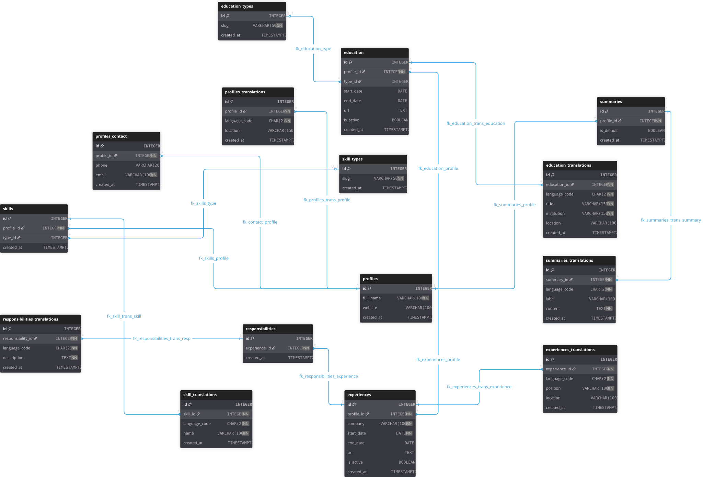

# Arquitectura de Base de Datos para Perfiles Multilingües

Este documento presenta la arquitectura técnica detallada de una base de datos diseñada para la gestión de perfiles profesionales con soporte de internacionalización (i18n) nativo. El diseño prioriza la integridad referencial y el desacoplamiento entre la estructura lógica de los datos y su representación en distintos idiomas.

## 📖 Tabla de Contenidos

- [📐 Introducción al Modelo Entidad-Relación (ERD)](#introducción-al-modelo-entidad-relación-erd)
- [🔗 Resumen de Cardinalidad y Relaciones](#resumen-de-cardinalidad-y-relaciones)
- [📖 Diccionario de Datos Detallado](#diccionario-de-datos-detallado)
- [🌐 Sistema de Internacionalización y Reglas de Integridad](#sistema-de-internacionalización-y-reglas-de-integridad)
- [🐘 Base de Datos PostgresSQL - Supabase](#base-de-datos-postgressql---supabase)
- [↩️ Regresar al README principal](../../README.md)

## 📐 Introducción al Modelo Entidad-Relación (ERD)

<figure align="center">
  
  <figcaption>
    <a href="https://dbdiagram.io/d/profiles-management-69fa525754a51d93d39b7377">🔗 Diagrama ERD, versión interactiva</a>
  </figcaption>
</figure>

El diseño de este esquema sigue un patrón de "núcleo y radios" (hub-and-spoke), donde la entidad `profiles` funciona como el nodo central de toda la arquitectura. De esta tabla raíz dependen jerárquicamente las entidades que componen la identidad profesional del usuario: información de contacto, resúmenes ejecutivos, experiencia laboral, formación académica y competencias técnicas.

Una característica fundamental de este modelo es la separación estricta entre metadatos estructurales y contenido literario. Mientras que las tablas base almacenan datos técnicos, fechas, URLs y relaciones de clasificación, el contenido textual susceptible de traducción se segrega en tablas con el sufijo `*_translations`. Este enfoque de normalización evita el crecimiento horizontal ineficiente de columnas (como `bio_en`, `bio_es`) y permite una escalabilidad ilimitada hacia nuevos idiomas sin alterar la lógica de negocio ni la estructura de las tablas principales.

## 🔗 Resumen de Cardinalidad y Relaciones

La siguiente tabla describe la interconectividad del sistema basada en el análisis de las claves foráneas y restricciones de unicidad definidas en el modelo:

|Entidad Origen   |Entidad Destino        |Cardinalidad|Definición Técnica Optimizada                          |
|-----------------|-----------------------|------------|-------------------------------------------------------|
|`profiles`       |`profiles_contact`     |1:1         |Garantizada mediante `UNIQUE INDEX` en `profile_id`.   |
|`profiles`       |`summaries`            |1:N         |FK con integridad referencial `DEFERRABLE`.            |
|`profiles`       |`experiences`          |1:N         |FK con borrado en cascada gestionado por índice.       |
|`profiles`       |`education`            |1:N         |FK hacia perfil con soporte de transacciones diferidas.|
|`profiles`       |`skills`               |1:N         |Relación escalable mediante `idx_skills_profile`.      |
|`experiences`    |`responsibilities`     |1:N         |Dependencia fuerte (Weak Entity) mediante FK.          |
|`education_types`|`education`            |1:N         |Protección de catálogo con `ON DELETE SET NULL`.       |
|`skill_types`    |`skills`               |1:N         |Protección de catálogo con `ON DELETE SET NULL`.       |
|Tablas Base      |Tablas `*_translations`|1:N         |Clave única compuesta mediante `idx_..._lang`.         |

## 📖 Diccionario de Datos Detallado

### Grupo: Perfil e Identidad Directa

Este grupo gestiona la identidad básica y los canales de comunicación. La relación 1:1 con el contacto se garantiza mediante una restricción `UNIQUE` en la clave foránea.

**Tabla: `profiles`**

|Columna     |Tipo        |Restricciones    |Descripción                                        |
|------------|------------|-----------------|---------------------------------------------------|
|`id`        |IDENTITY    |**PK**           |Identificador único autoincremental (estándar SQL).|
|`full_name` |VARCHAR(100)|**NOT NULL**     |Nombre completo del profesional.                   |
|`website`   |VARCHAR(100)|**-**            |URL del sitio web o portafolio personal.           |
|`created_at`|TIMESTAMPTZ |**DEFAULT now()**|Marca de tiempo de creación con zona horaria.      |

**Tabla: `profiles_contact`**

|Columna     |Tipo        |Restricciones                                                                |Descripción                               |
|------------|------------|-----------------------------------------------------------------------------|------------------------------------------|
|`id`        |IDENTITY    |**PK**                                                                       |Identificador único.                      |
|`profile_id`|INTEGER     |**FK** (`fk_contact_profile`), **UNIQUE** (`idx_profiles_contact_profile_id`)|Relación 1:1, permite validación diferida.|
|`phone`     |VARCHAR(20) |**-**                                                                        |Teléfono.                                 |
|`email`     |VARCHAR(100)|**UNIQUE** (idx_profiles_contact_email), **NOT NULL**                        |Correo electrónico validado.              |
|`created_at`|TIMESTAMPTZ |**DEFAULT now()**                                                            |Auditoría de creación.                    |

### Grupo: Contenido Profesional

Gestiona la narrativa laboral y los hitos de carrera del perfil.

**Tabla: `summaries`**

|Columna     |Tipo       |Restricciones                  |Descripción                            |
|------------|-----------|-------------------------------|---------------------------------------|
|`id`        |IDENTITY   |**PK**                         |ID único del resumen.                  |
|`profile_id`|INTEGER    |**FK** (`fk_summaries_profile`)|Referencia al perfil dueño.            |
|`is_default`|BOOLEAN    |**DEFAULT false**              |Define si este resumen es el principal.|
|`created_at`|TIMESTAMPTZ|**DEFAULT now()**              |Fecha de creación.                     |

**Tabla: `experiences`**

|Columna     |Tipo        |Restricciones                              |Descripción                              |
|------------|------------|-------------------------------------------|-----------------------------------------|
|`id`        |IDENTITY    |**PK**                                     |ID único de experiencia.                 |
|`profile_id`|INTEGER     |**NOT NULL, FK** (`fk_experiences_profile`)|Referencia al perfil dueño.              |
|`company`   |VARCHAR(100)|**NOT NULL**                               |Nombre de la organización.               |
|`start_date`|DATE        |**NOT NULL**                               |Fecha de inicio de labores.              |
|`end_date`  |DATE        |**-**                                      |Fecha de cese (NULL indica "actualidad").|
|`url`       |TEXT        |**-**                                      |Enlace a la empresa o proyecto.          |
|`is_active` |BOOLEAN     |**DEFAULT true**                           |Control de visibilidad en el CV.         |
|`created_at`|TIMESTAMPTZ |**DEFAULT now()**                          |Fecha de creación.                       |

**Tabla: `responsibilities`**

|Columna        |Tipo       |Restricciones                                      |Descripción                                   |
|---------------|-----------|---------------------------------------------------|----------------------------------------------|
|`id`           |IDENTITY   |**PK**                                             |ID único de responsabilidad.                  |
|`experience_id`|INTEGER    |**NOT NULL, FK** (`fk_responsibilities_experience`)|Vínculo con la experiencia laboral específica.|
|`created_at`   |TIMESTAMPTZ|**DEFAULT now()**                                  |Fecha de registro.                            |

### Grupo: Educación y Habilidades

Define la taxonomía de grados académicos y habilidades. Note que las tablas de tipos no utilizan borrado en cascada para proteger la integridad de los catálogos.

**Tabla: `education_types` / `skill_types` (Catálogos)**

|Columna     |Tipo       |Restricciones                          |Descripción                               |
|------------|-----------|---------------------------------------|------------------------------------------|
|`id`        |IDENTITY   |**PK**                                 |ID único del tipo de categoría.           |
|`slug`      |VARCHAR(50)|**NOT NULL, UNIQUE** (idx_[tabla]_slug)|Código único (ej: 'master', 'tech-stack').|
|`created_at`|TIMESTAMPTZ|**DEFAULT now()**                      |Fecha de creación.                        |

**Tabla: `education`**

|Columna     |Tipo       |Restricciones                                      |Descripción                      |
|------------|-----------|---------------------------------------------------|---------------------------------|
|`id`        |IDENTITY   |**PK**                                             |ID único de educación.           |
|`profile_id`|INTEGER    |**NOT FULL, FK** (`fk_education_profile`)          |Perfil asociado.                 |
|`type_id`   |INTEGER    |**FK** (`fk_education_type`) **ON DELETE SET NULL**|Categoría (Grado, Curso, etc.).  |
|`start_date`|DATE       |**-**                                              |Inicio del estudio.              |
|`end_date`  |DATE       |**-**                                              |Fin del estudio.                 |
|`url`       |TEXT       |**-**                                              |Link a certificado o institución.|
|`is_active` |BOOLEAN    |**DEFAULT true**                                   |Visibilidad del registro.        |
|`created_at`|TIMESTAMPTZ|**DEFAULT now()**                                  |Fecha de registro.               |

**Tabla: `skills`**

|Columna     |Tipo       |Restricciones                                   |Descripción                       |
|------------|-----------|------------------------------------------------|----------------------------------|
|`iZd`       |IDENTITY   |**PK**                                          |ID único de habilidad.            |
|`profile_id`|INTEGER    |**NOT NULL, FK** (`fk_skills_profile`)          |Perfil asociado.                  |
|`type_id`   |INTEGER    |**FK** (`fk_skills_type`) **ON DELETE SET NULL**|Categoría (Blanda, Técnica, etc.).|
|`created_at`|TIMESTAMPTZ|**DEFAULT now()**                               |Fecha de registro.                |

### Grupo de Traducciones

Todas las tablas de este grupo comparten la restricción *`UNIQUE`* compuesta por *[parent_id]* y *`language_code`* mediante un índice *`idx_..._lang`*, asegurando una sola versión por idioma.

**Tabla: `profiles_translations`**

|Columna        |Tipo        |Restricciones                      |Descripción                    |
|---------------|------------|-----------------------------------|-------------------------------|
|`id`           |IDENTITY    |**PK**                             |ID de traducción.              |
|`profile_id`   |INTEGER     |**FK** (`fk_profiles_trans_profile`)|Vínculo al perfil base.       |
|`language_code`|CHAR(2)     |**NOT NULL**                       |ISO del idioma (es, en).       |
|`location`     |VARCHAR(150)|**-**                              |Ubicación geográfica traducida.|
|`created_at`   |TIMESTAMPTZ |**DEFAULT now()**                  | Fecha de creación             |

**Tabla: `summaries_translations`**

|Columna        |Tipo        |Restricciones                        |Descripción                                   |
|---------------|------------|-------------------------------------|----------------------------------------------|
|`id`           |IDENTITY    |**PK**                               |ID de traducción.                             |
|`summary_id`   |INTEGER     |**FK** (`fk_sumdmaries_trans_summary`)|Vínculo al resumen base.                      |
|`language_code`|CHAR(2)     |**NOT NULL**                         |ISO del idioma.                               |
|`label`        |VARCHAR(100)|**-**                                |Título descriptivo (ej: "Perfil Profesional").|
|`content`      |TEXT        |**NOT NULL**                         |Cuerpo del resumen traducido.                 |
|`created_at`   |TIMESTAMPTZ |**DEFAULT now()**                    |Fecha de creación                             |

**Tabla: `experiences_translations`**

|Columna        |Tipo        |Restricciones                             |Descripción                        |
|---------------|------------|------------------------------------------|-----------------------------------|
|`id`           |IDENTITY    |**PK**                                    |ID de traducción.                  |
|`experience_id`|INTEGER     |**FK** (`fk_experiences_trans_experience`)|Vínculo a la experiencia base.     |
|`language_code`|CHAR(2)     |**NOT NULL**                              |ISO del idioma.                    |
|`position`     |VARCHAR(100)|**NOT NULL**                              |Cargo o puesto (ej: "Senior  Dev").|
|`location`     |VARCHAR(100)|**-**                                     |Lugar de trabajo traducido.        |
|`created_at`   |TIMESTAMPTZ |**DEFAULT now()**                         |Fecha de creación                  |

**Tabla: `responsibilities_translZations`**

|Columna            |Tipo        |Restricciones                            |Descripción                    |
|-------------------|------------|-----------------------------------------|-------------------------------|
|`id`               |IDENTITY    |**PK**                                   |ID de traducción.              |
|`responsibility_id`|INTEGER     |**FK** (`fk_responsibilities_trans_resp`)|Vínculo a responsabilidad base.|
|`language_code`    |CHAR(2)     |**NOT NULL**                             |ISO del idioma.                |
|`description`      |TEXT        |**NOT NULL**                             |Detalle de la tarea realizada. |
|`created_at`       |TIMESTAMPTZ |**DEFAULT now()**                        |Fecha de creación              |

**Tabla: `education_translations`**

|Columna        |Tipo        |Restricciones                          |Descripción                    |
|---------------|------------|---------------------------------------|-------------------------------|
|`id`           |IDENTITY    |**PK**                                 |ID de traducción.              |
|`education_id` |INTEGER     |**FK** (`fk_education_trans_education`)|Vínculo a educación base.      |
|`language_code`|CHAR(2)     |**NOT NULL**                           |ISO del idioma.                |
|`title`        |VARCHAR(150)|**NOT NULL**                           |Título obtenido.               |
|`institution`  |VARCHAR(150)|**NOT NULL**                           |Nombre de la entidad educativa.|
|`location`     |VARCHAR(100)|**-**                                  |Ciudad/País de estudio.        |
|`created_at`   |TIMESTAMPTZ |**DEFAULT now()**                      |Fecha de creación              |

**Tabla: `skill_translations`**

|Columna        |Tipo        |Restricciones                  |Descripción                        |
|---------------|------------|-------------------------------|-----------------------------------|
|`id`           |IDENTITY    |**PK**                         |ID de traducción.                  |
|`skill_id`     |INTEGER     |**FK** (`fk_skill_trans_skill`)|Vínculo a habilidad base.          |
|`language_code`|CHAR(2)     |**NOT NULL**                   |ISO del idioma.                    |
|`name`         |VARCHAR(100)|**NOT NULL**                   |Nombre de la competencia traducido.|
|`created_at`   |TIMESTAMPTZ |**DEFAULT now()**              |Fecha de creación                  |

## 🌐 Sistema de Internacionalización y Reglas de Integridad

### Estrategia de Internacionalización

El sistema implementa el estándar ISO 639-1 mediante el uso del tipo de dato `CHAR(2)` para la columna `language_code`. Esta arquitectura es superior a la proliferación de columnas (denominada técnicamente como "Column Proliferation"), ya que permite filtrar el contenido mediante una única cláusula `WHERE` sin necesidad de alterar el esquema para soportar nuevos idiomas. La separación del contenido literario garantiza que la lógica de ordenamiento cronológico o filtrado por tipos se mantenga independiente del lenguaje en el que se visualice la información.

### Integridad Referencial y Mantenimiento Cascada

Para asegurar la consistencia absoluta de los datos, se ha implementado la cláusula `ON DELETE CASCADE` en todas las claves foráneas vinculadas a la entidad raíz `profiles`.

Este mecanismo garantiza que la eliminación de un perfil profesional resulte en una limpieza atómica y automática de todos los registros dependientes: información de contacto, experiencias, responsabilidades y todas sus respectivas traducciones. Esto elimina el riesgo de "orfandad de datos" y reduce la sobrecarga en la capa de aplicación, dejando que el motor de la base de datos gestione la integridad estructural de forma nativa y eficiente. El único caso exceptuado son los catálogos de tipos (`education_types` y `skill_types`), cuya persistencia es necesaria para la consistencia de otros perfiles existentes.

## 🐘 Base de Datos PostgresSQL - Supabase

Abarca todo lo que se es: formación, habilidades y trayectoria. Es "la identidad profesional" normalizada en tablas.

### Estructuración

Los scripts se encuentran organizados en la carpeta `./database/` bajo la siguiente jerarquía:

|Carpeta       |Descripción                               |
|--------------|------------------------------------------|
|./01-schema/  |Definición de tablas y relaciones (DDL).  |
|./02-logic/   |Vistas y funciones de procesamiento (RPC).|
|./03-security/|Aplicar RLS y politicas.                  |
|./04-seeds/   |Inserción para datos maestros.            |
|./functions/  |Edge Functions.                           |

> _**Nota**: Para una instalación limpia, ejecute los scripts en el orden numérico indicado en cada carpeta._

#### 1. Data Definition Language (DDL / schema)

1. [Extensions](./01-schema/01-extensions.sql)

2. [Base data tables](./01-schema/02-base-data-tables.sql)

3. [Translation tables](./01-schema/03-trannslation-tables.sql)

#### 2. Logica (logic)

1. [View profiles public](./02-logic/01-view-profiles-public.sql)

2. [RPC fetch full profile](./02-logic/02-rpc-fetch-full-profile.sql)

#### 3. Seguridad y Políticas (security)

1. [RLS enable all tables](./03-security/01-rls-enable-all-tables.sql)

2. [Policies public reading](./03-security/02-policies-public-reading.sql)

> _**Nota:** Siempre que modifique una tabla en `./01-schema/`, verifique si las políticas en `./03-security/` o las funciones en `./02-logic/` necesitan una actualización. La integridad del sistema depende de la sincronía entre estas tres capas."_

#### 4. Carga Inicial de Datos (DML / seeds)

La carga se realizará en dos etapas, asegurando que las llaves foraneas (los IDs) existan antes de insertar las traducciones.

Como se hara una carga inicial limpia, se prepararán los queries de SQL para pegarlos directamente el SQL Editor de Supabase, siendo más rápido y seguro que hacerlo por JS para una población masiva de datos.

1. [Master data base](./04-seeds/01-master-data-base.sql)

2. [Master data trsnslation](./04-seeds/02-master-data-trsnslation.sql)

#### Edge Functions (functions)

- [get-profile](./functions/get-profile/index.ts)